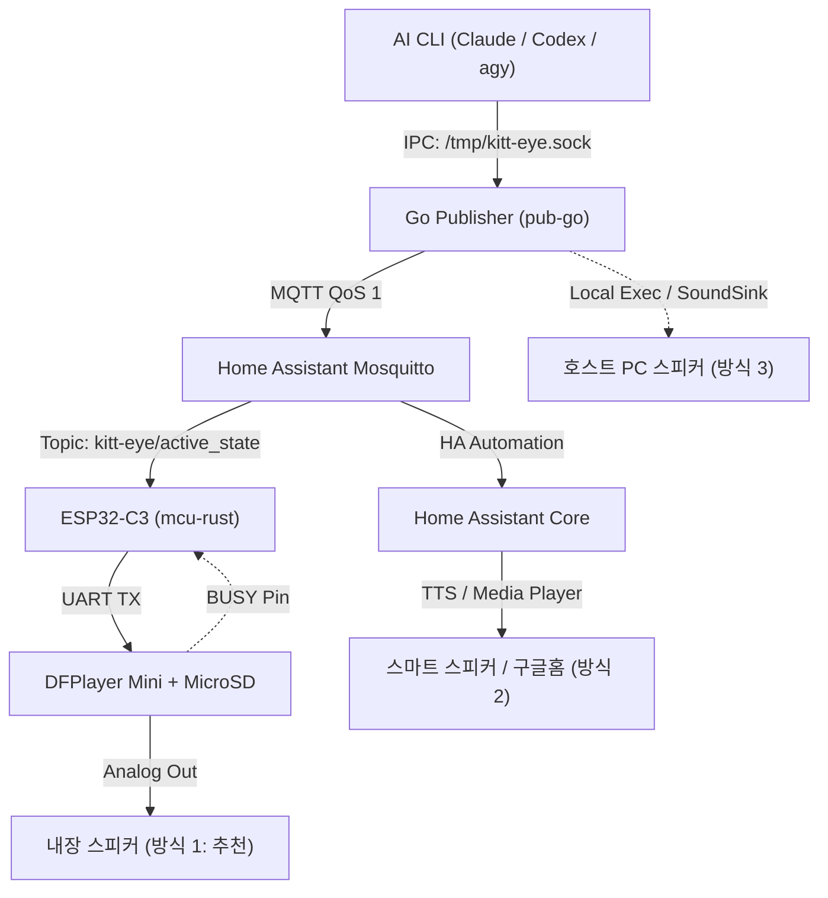

# K.I.T.T. Voice System Design (음성 출력 시스템 설계)

본 문서는 `kitt-eye` 시스템에서 AI 에이전트의 상태 변화에 따라 **K.I.T.T. 특유의 시그니처 사운드 및 음성(Voice)**이 출력되도록 확장하는 종합 아키텍처 설계서입니다.

---

## 1. 개요 및 설계 목표

현재 `kitt-eye`는 AI CLI 에이전트의 상태(`thinking`, `executing_tool`, `waiting_input`, `done`, `error` 등)를 Unix Domain Socket 및 MQTT를 거쳐 ESP32-C3의 WS2812B NeoPixel LED 바로 시각화하고 있습니다.

여기에 **음성/오디오 시스템**을 추가하여 다음 목표를 달성합니다:
1. **시청각 일체형 피드백**: LED 스캐너 시각 피드백에 더해, 화면을 보지 않고도 AI 에이전트의 진행 상황(도구 실행, 사용자 확인 대기, 완료, 에러 등)을 즉시 인지.
2. **K.I.T.T. 원작 감성 구현**: 1980년대 《전격 Z 작전》 원작의 인공지능 슈퍼카 K.I.T.T.의 명대사([kitt_qoutes.md](file:///Users/suapapa/ws/kitt-eye/docs/kitt_qoutes.md))와 특유의 컴퓨터 효과음 재현.
3. **Voice Box 연동 연출**: 음성이 재생되는 동안 8구 LED 바가 가운데에서 양옆으로 요동치는 **Voice Box(Center-Out)** 애니메이션으로 자동 전환되어 실제 키트가 말하는 듯한 시각 효과 제공.

---

## 2. 시나리오 및 상태별 대사/효과음 매핑

음성은 상태가 지속되는 동안 계속 울리는 것이 아니라, **상태 전이(State Transition) 시점에 1회 재생**됩니다.

| 상태 (`active_state`) | 상황 설명 | K.I.T.T. 시그니처 음성 (영문 / 한글) | 효과음 (SFX) |
|---|---|---|---|
| `idle` | 대기 상태 복귀 | *"All systems operational, Michael."*<br>*(모든 시스템 정상 대기 중입니다.)* | 시스템 험(Hum) |
| `thinking` | 프롬프트 분석/추론 중 | *"Scanning and analyzing, Michael."*<br>*(데이터를 분석하고 있습니다.)* | 고속 컴퓨터 연산 비프음 |
| `generating` | 응답/코드 스트리밍 생성 중 | *"Processing solution."*<br>*(해결책을 생성 중입니다.)* | 시퀀서 연산음 |
| `executing_tool` | Bash/빌드/테스트 등 도구 실행 | *"Right away, Michael."*<br>*(즉시 수행하겠습니다, 마이클.)* | **K.I.T.T. 스캐너 펄스음** |
| `waiting_input` | 사용자 확인/입력 대기 중 | *"Michael, I need your authorization."*<br>*(마이클, 확인 및 승인이 필요합니다.)* | 2중 주의 환기 알림음 (Double Chime) |
| `done` | 모든 작업 정상 완료 | *"Task completed successfully, Michael."*<br>*(작업이 성공적으로 끝났습니다.)* | 긍정 완료 챠임 (Success Chime) |
| `error` | 실행 실패/오류 발생 | *"Warning, Michael! An error has occurred."*<br>*(경고, 시스템에 오류가 발생했습니다.)* | 경보음 (Alert Siren / Klaxon) |

---

## 3. 핵심 연출: 음성-LED 동기화 (Voice Box Effect)

원작 K.I.T.T.의 대시보드 중앙에는 음성이 출력될 때 소리의 음량에 따라 붉은색 막대가 좌우로 요동치는 **Voice Box**가 장착되어 있습니다.

```text
[ 평상시: K.I.T.T. 스캐너 좌우 왕복 모션 ]
◀── [■■■░░░░░] ──►

[ 음성 출력 중: Voice Box (Center-Out 모션) ]
      [░░■■■■░░]
    [░■■■■■■■░]
      [░░■■■■░░]
```

- 현재 `mcu-rust`에는 [`LedEngine::step_center_out()`](file:///Users/suapapa/ws/kitt-eye/mcu-rust/src/patterns.rs#L164-L187) 패턴이 이미 구현되어 있습니다.
- 오디오가 재생 중일 때는 활성 상태의 기본 패턴(예: `KittScanner`)을 일시 중단하고, `step_center_out` 패턴을 우선 렌더링합니다.
- 재생이 종료되면 원래 상태의 애니메이션 패턴으로 부드럽게 복귀합니다.

---

## 4. 구현 아키텍처 비교 및 분석

현재 시스템 구조에서 음성을 출력할 수 있는 3가지 주요 방식입니다.



| 비교 항목 | **방식 1. ESP32-C3 + DFPlayer Mini**<br>(하드웨어 완성형, **강력 추천**) | **방식 2. Home Assistant 스마트 스피커**<br>(무설치 소프트웨어형) | **방식 3. Go 데몬 호스트 재생**<br>(로컬 데스크톱형) |
|---|---|---|---|
| **소리 출력 장치** | **K.I.T.T. 디바이스 자체 내장 스피커** | 거실/서재의 **스마트 스피커** (Google/Apple/HA) | 작업 중인 **개발 PC / Mac 스피커** |
| **추가 부품 비용** | 약 3,000 ~ 5,000원<br>(DFPlayer Mini, MicroSD, 8Ω 스피커) | **0원 (기존 인프라 활용)** | **0원** |
| **ESP32-C3 부하** | **거의 0%** (UART 10바이트 시리얼 전송) | **0%** (ESP32-C3 코드 수정 없음) | **0%** |
| **음성 동적 생성** | 사전 녹음된 MP3/WAV 고음질 파일 재생 | **동적 TTS 가능** (에이전트 `detail` 메시지 발화) | OS 내장 TTS (`say` 등) 또는 사운드 파일 |
| **Voice Box 동기화** | **완벽 지원** (BUSY 핀 하드웨어 직결) | 네트워크 지연으로 정밀 동기화 어려움 | 정밀 동기화 어려움 |
| **장단점 요약** | 피지컬 K.I.T.T. 디바이스로서의 완성도 극대화 | 하드웨어 작업 없이 오늘 즉시 사용 가능 | 터미널 작업 중 가장 단순한 알림 |

---

## 5. [방식 1] 하드웨어 확장 상세 설계 (ESP32-C3 + DFPlayer Mini)

ESP32-C3는 내장 DAC가 없으므로, 저렴하고 신뢰성 높은 하드웨어 MP3 디코더 모듈인 **DFPlayer Mini**를 UART로 연동하는 것이 최적의 설계입니다.

### 5.1. 하드웨어 배선 및 핀맵 (Pin Allocation)

현재 `mcu-rust`는 `GPIO6`(SPI2 MOSI)과 `GPIO4`(SPI2 SCK)를 사용 중입니다. ESP32-C3의 여유 GPIO 핀을 다음과 같이 할당합니다:

```text
[ ESP32-C3 SuperMini ]                         [ DFPlayer Mini ]               [ 스피커 ]
       5V (VBUS) ─────────────────────────────────── VCC
          GND    ─────────────────────────────────── GND
    GPIO7 (UART TX) ────[ 1kΩ 저항 ]───────────────── RX (명령 수신)
    GPIO8 (UART RX) ──────────────────────────────── TX (상태 응답, 옵션)
    GPIO5 (Input)   ──────────────────────────────── BUSY (재생 감지 핀)
                                                     SPK_1 ──────────────────────── (+) 8Ω 2~3W
                                                     SPK_2 ──────────────────────── (-) 소형 스피커
```

> [!TIP]
> **BUSY 핀을 활용한 하드웨어 레벨 Voice Box 동기화**:
> DFPlayer Mini의 `BUSY` 핀은 음원이 재생되는 동안 하드웨어적으로 `LOW(0V)`가 되고, 재생이 끝나면 `HIGH(3.3V)`가 됩니다.
> ESP32-C3는 복잡한 소프트웨어 타이머나 시리얼 파싱 없이, 단순히 `GPIO5.is_low()`를 검사하여 음성 출력 여부를 100% 신뢰성 있게 판별할 수 있습니다.

### 5.2. MicroSD 카드 음원 파일 구성

MicroSD 카드를 FAT32로 포맷하고 루트의 `/mp3` 디렉터리에 다음 넘버링 규칙으로 저장합니다:

```text
/mp3/
├── 0001.mp3  # [idle]           "All systems operational, Michael."
├── 0002.mp3  # [thinking]       컴퓨터 연산 비프음 + "Analyzing data"
├── 0003.mp3  # [generating]     시퀀서 효과음
├── 0004.mp3  # [executing_tool] K.I.T.T. 스캐너 펄스음 + "Executing command"
├── 0005.mp3  # [waiting_input]  "Michael, I need your authorization."
├── 0006.mp3  # [done]           "Task completed successfully, Michael."
└── 0007.mp3  # [error]          "Warning, Michael! An error has occurred."
```

### 5.3. `mcu-rust` 펌웨어 구현 설계

#### 1) DFPlayer 시리얼 패킷 규격 (`src/dfplayer.rs`)
DFPlayer Mini 표준 10바이트 시리얼 명령:
```text
[ 0x7E, 0xFF, 0x06, CMD, 0x00, Param_H, Param_L, Chk_H, Chk_L, 0xEF ]
```
- `CMD 0x03`: 지정 트랙 재생 (`Param`: 트랙 번호 1~2999)
- `CMD 0x06`: 볼륨 설정 (`Param`: 0 ~ 30)

#### 2) 메인 루프 동기화 ([main.rs](file:///Users/suapapa/ws/kitt-eye/mcu-rust/src/bin/main.rs))
```rust
// GPIO5를 BUSY 핀으로 입력 설정 (풀업)
let busy_pin = peripherals.GPIO5;

loop {
    let wifi_up = WIFI_CONNECTED.load(Ordering::Relaxed);
    let is_speaking = busy_pin.is_low(); // LOW = 소리 재생 중

    let frame = if is_speaking {
        // 음성 출력 중: Voice Box(Center-Out) 패턴 강제 적용
        engine.step_voice_box()
    } else if wifi_up {
        let state = AgentState::from_u8(ACTIVE_STATE.load(Ordering::Relaxed));
        engine.set_state(state);
        *engine.step()
    } else {
        *engine.step_wifi_wait()
    };

    critical_section::with(|_| {
        let _ = strip.write(brightness(frame.into_iter(), BRIGHTNESS));
    });

    Timer::after(Duration::from_millis(ANIM_SPEED_MS as u64)).await;
}
```

#### 3) MQTT 수신 시 상태 변경 감지
`mqtt_task`에서 새로운 `active_state`가 수신되었을 때:
- `current_state != previous_state`인 경우에만
- 상태에 매핑된 트랙 번호를 UART TX로 전송합니다.

---

## 6. [방식 2] Home Assistant & 스마트 스피커 연동 설계

기존의 Home Assistant 인프라를 그대로 활용하여, 방/거실의 스마트 스피커를 통해 고품질 K.I.T.T. 목소리를 재생하는 방식입니다.

### 6.1. Home Assistant 자동화 (`automations.yaml`)

```yaml
automation:
  - alias: "K.I.T.T. Voice Assistant Alert"
    trigger:
      - platform: mqtt
        topic: "kitt-eye/active_state"
    condition:
      # 대기 상태 복귀 시에는 알림을 생략하고 주요 전환만 발화
      - condition: template
        value_template: "{{ trigger.payload in ['executing_tool', 'waiting_input', 'done', 'error'] }}"
    action:
      - choose:
          # 1. 사용자 승인 대기 시
          - conditions: "{{ trigger.payload == 'waiting_input' }}"
            sequence:
              - service: tts.speak
                target:
                  entity_id: tts.piper # 또는 cloud TTS (ElevenLabs KITT 보이스 모델)
                data:
                  media_player_entity_id: media_player.desk_speaker
                  message: "마이클, 사용자 승인이 필요합니다."

          # 2. 작업 정상 완료 시
          - conditions: "{{ trigger.payload == 'done' }}"
            sequence:
              - service: media_player.play_media
                target:
                  entity_id: media_player.desk_speaker
                data:
                  media_content_id: "http://homeassistant.local:8123/local/sounds/kitt_done.mp3"
                  media_content_type: "audio/mp3"

          # 3. 에러 발생 시
          - conditions: "{{ trigger.payload == 'error' }}"
            sequence:
              - service: tts.speak
                target:
                  entity_id: tts.piper
                data:
                  media_player_entity_id: media_player.desk_speaker
                  message: "경고, 마이클! 작업 중 오류가 발생했습니다."
```

### 6.2. 동적 상세 정보 (`detail`) 읽어주기 (심화)
`kitt-eye/agents/{agent}/sessions` 토픽의 JSON 페이로드에서 `detail` 필드(예: `"Bash: npm test"`, `"Reading file"`)를 추출하여 TTS 템플릿에 주입하면, **"마이클, 테스트를 실행 중입니다"**와 같이 실시간 동적 안내가 가능합니다.

---

## 7. [방식 3] Go 데몬 호스트 로컬 사운드 설계

개발 머신(Mac/Linux)에서 데몬이 실행될 때 스피커로 로컬 효과음을 재생합니다.

### 7.1. [config.yaml](file:///Users/suapapa/ws/kitt-eye/config.example.yaml) 설정 추가
```yaml
sound:
  enabled: true
  volume: 75
  backend: "native" # "native" (afplay/aplay) 또는 "tts" (say)
  sound_dir: "/usr/local/share/kitt-eye/sounds"
```

### 7.2. `pub-go` 구현
[`pub-go/internal/publish`](file:///Users/suapapa/ws/kitt-eye/pub-go/cmd/kitteye/main.go#L66-L85)에 `SoundSink`를 추가하여 `PublishActive` 호출 시 이전 상태와 다를 경우 OS 커맨드를 백그라운드로 실행합니다:
- **macOS**: `exec.Command("afplay", soundPath)` 또는 `exec.Command("say", "-v", "Fred", message)`
- **Linux**: `exec.Command("aplay", soundPath)` 또는 `exec.Command("paplay", soundPath)`

---

## 8. 단계별 구현 및 권장 진행 절차

1. **1단계: Home Assistant 자동화 또는 로컬 사운드 적용**
   - 추가 하드웨어 없이 `kitt-eye/active_state` 변경 시 음성 알림이 발생하는 경험을 즉시 체감.
2. **2단계: 하드웨어 모듈 수급 및 배선**
   - DFPlayer Mini(약 2,000원), 8Ω 2W 미니 스피커(약 1,000원), 저용량 MicroSD 카드 준비.
   - ESP32-C3의 `GPIO7`(TX), `GPIO8`(RX), `GPIO5`(BUSY)에 연결.
3. **3단계: `mcu-rust` 펌웨어 업데이트**
   - `Uart` 드라이버를 초기화하여 상태 전이 시 트랙 재생 명령 전송.
   - `BUSY` 핀 상태에 따라 LED 바를 `CenterOut`(Voice Box) 애니메이션으로 동기화 구현.
