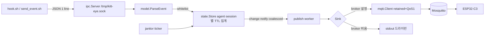

# `pub-go` 구현 계획 (Go Publisher 데몬)

> 상위 설계: [`../PLAN.md`](../PLAN.md) §4.1(프로토콜)·§4.2(퍼블리셔)·§4.4~4.7(훅).
> 이 문서는 pub-go 컴포넌트의 구현 단계·파일 단위 설계를 다룬다.

## 1. 목표 / 비목표

- **목표**: CLI 훅이 보낸 JSON 이벤트(UDS)를 수신 → 세션 TTL/우선순위 집계 → Mosquitto로 retained publish. 데몬 크래시 대비 LWT + stale TTL 안전망.
- **비목표(v1)**: TLS, MQTT 구독(양방향), 메시지 재전송 큐, 에이전트 인증(UDS 파일권한이 곧 접근권한).

## 2. 패키지 구조

```text
pub-go/
├── go.mod                      # module github.com/suapapa/kitt-eye/pub
└── cmd/ kitteye/ main.go       # wiring: config → store → sinks → ipc → janitor
└── internal/
    ├── config/                 # YAML 로더 + 기본값 + 검증 + 환경변수 폴백
    ├── model/                  # Event/state wire 프로토콜 (PLAN.md §4.1.2 v1.0/v1.1)
    ├── state/                  # SessionStore: 세션 TTL·우선순위 집계 (fake-clock 단위테스트)
    ├── ipc/                    # Unix Domain Socket 서버 (데이터그램 1줄/연결)
    ├── mqtt/                   # paho 래퍼: reconnect/LWT/retained/HA discovery
    └── publish/                # Sink 인터페이스 + stdout(드라이런) 싱크
```

## 3. 데이터 흐름



- 훅은 fire-and-forget: 수신 경로는 **절대 블록 금지** → notify는 `chan struct{}(1)`으로 코얼레스, publish는 별도 워커가 현재 스냅샷만 발행.

## 4. IPC 프로토콜 (`ipc`)

- 요청: UDS 연결당 JSON 한 줄(개행 없음도 허용), 8 KB 초과 드롭, 읽기 타임아웃 5 s.
- `agent`: `[A-Za-z0-9][A-Za-z0-9_-]{0,31}` (토픽 주입 방지), `session_id` 미전송 시 `default`, `detail`은 제어문자 제거+120자 제한.
- 응답 없음. 파싱/화이트리스트 실패는 debug 로그 후 조용히 드롭(훅을 망가뜨리지 않는다).
- 시작 시 기존 소켓에 연결 성공 → "이미 실행 중" 오류로 종료; 스텐일 파일은 제거 후 listen.

## 5. 상태 기계 / TTL (`state`)

| 상태 | 만료 규칙 |
| --- | --- |
| `done` | `done_ttl`(기본 15 s) 후 `idle` |
| `error` | `error_ttl`(60 s) 후 `idle` |
| `thinking`/`generating`/`executing_tool`/`waiting_input` | `stale_ttl`(300 s) 무更新 시 `idle`(훅 유실·크래시 안전망, PLAN §4.4.6-1) |
| `idle` | `session_ttl`(3600 s) 후 세션 제거, 마지막 세션이면 에이전트 제거 |

- 집계 우선순위: `error` > `waiting_input` > `executing_tool` > `generating` > `thinking` > `done` > `idle`. 동률 시 최근 갱신.
- 에이전트 상태 = 활성 세션들의 max 우선순위. 전역 `active_state` = 에이전트 집계들의 max 우선순위.
- `max_sessions`(글로벌 8, 에이전트별 override): 초과 시 신규 세션 수용 + 최저 우선순위·최장시간 세션 eviction.

## 6. MQTT 규격 (`mqtt`)

| 토픽 | payload | QoS | retain |
| --- | --- | --- | --- |
| `kitt-eye/agents/<agent>/state` | 상태 문자열 | 1 | yes |
| `kitt-eye/agents/<agent>/sessions` | `{"agent","state","sessions":[...],"updated_at"}` | 1 | yes |
| `kitt-eye/active_state` / `active_agent` | 대표 상태 / 에이전트명 | 1 | yes |
| `kitt-eye/system/status` | `online`/`offline` | 1 | yes |
| LWT `.../system/status` | `offline` | 1 | yes |
| (선택) `homeassistant/sensor/kitt_eye_*/config` | discovery JSON | 1 | yes |

- `AutoReconnect`(≤30 s backoff) + `OnConnect` 후 재발행(online + 전체 스냅샷 → ESP32 재부팅 후에도 retained로 즉시 복원).
- graceful shutdown: `offline` 발행 후 disconnect(비정상 종료는 LWT가 담당).
- HA discovery는 `homeassistant.discovery: true`일 때만.

## 7. 설정

`../config.example.yaml` 참조. `mqtt.broker` 비우면 **드라이런 모드**(stdout JSON 라인) → 브로커 없이 훅→집계 파이프라인 검증 가능.
env 폴백: `KITTEYE_CONFIG`, `KITTEYE_MQTT_BROKER`, `KITTEYE_MQTT_PASSWORD`(비번을 파일에 남기지 않기 위함).

## 8. 테스트 매트릭스

| 패키지 | 검증 |
| --- | --- |
| `model` | v1.0/v1.1 파싱, agent/state/session 검증, detail 살균·절단, 우선순위 |
| `config` | 기본값, strict(미지의 키 거부), 검증 실패, env 폴백 |
| `state` | fake-clock TTL 만료/제거, stale 승격, 우선순위 집계, eviction victim, 정렬 스냅샷 |
| `ipc` | 실제 UDS로 이벤트 2건 수신, 개행 생략, 초과 드롭, 이중 실행 거부, Close 정리 |
| `mqtt` | 실브로커 스모크(env `KITTEYE_TEST_MQTT` 설정 시만 실행) |

## 9. 마일스톤

- [x] **M0 스캐폴드**: go.mod(go 1.24, paho v1.5.1 캐시 버전, x/net pin)·config·main 골격
- [x] **M1 코어(브로커 불필요)**: model + state(TTL/집계) + ipc + stdout 드라이런
- [x] **M2 MQTT**: retained/QoS1/LWT/reconnect 재발행, graceful offline
- [x] **M3 옵션**: HA discovery, sessions 토픽, 문서
- [ ] **M4 통합(수동)**: `mosquitto_sub` 스모크 → Step 5(§5 로드맵)로 승계

## 10. 로컬 검증 절차

```bash
make build-pub                                   # go build ./cmd/kitteye
cd pub-go && go test ./...                       # 단위 테스트(오프라인)
# 드라이런: 훅→집계 관찰
./bin/kitt-eye-pub --config /tmp/dryrun.yaml     # broker 빈 설정 + nc -U 소켓 전송
# 실브로커(Home Lab)
mosquitto_sub -h homeassistant.local -p 1883 -u <user> -P <pw> -v -t 'kitt-eye/#'
echo '{"agent":"claude","state":"executing_tool","detail":"Bash: npm test","session_id":"s1"}' \
  | nc -U -w 1 /tmp/kitt-eye.sock                # → agents/claude/*, active_state 확인
mosquitto_sub ... -t 'kitt-eye/system/status'    # 데몬 kill 후 LWT offline 확인
```

## 11. 이후 확장

- 훅 쪽 `send_event.sh` v1.1(`session_id`/`event` 인자)·`install-hooks` 타깃은 상위 로드맵 Step 3 소관.
- TLS/wss 브로커, 토픽 prefix 스키마 마이그레이션(v2), 세션 이벤트 히스토리 링버퍼(디스플레이용).
